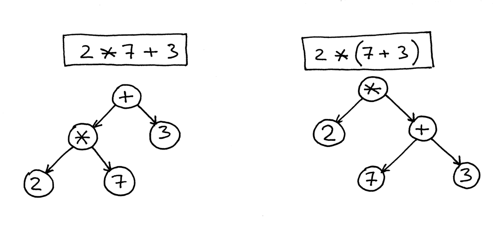
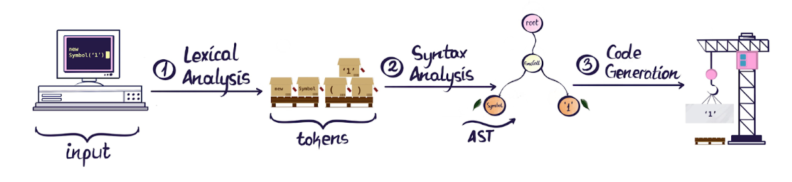
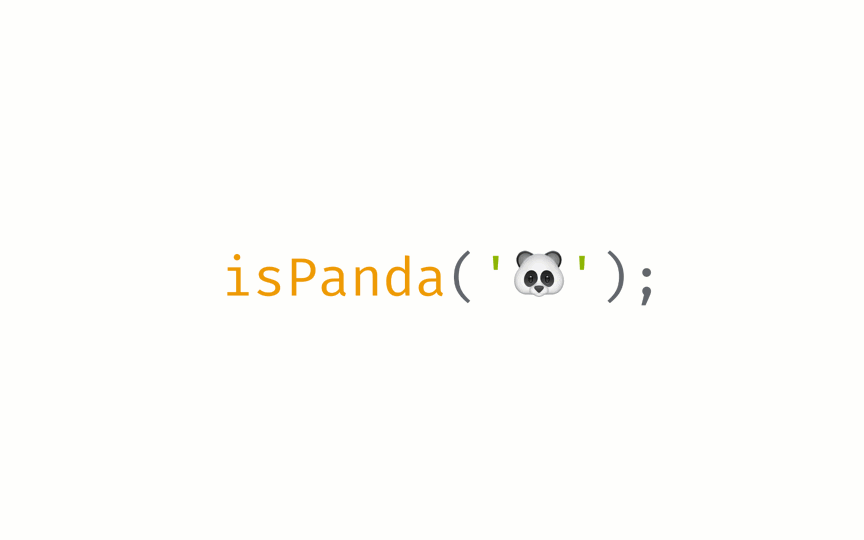
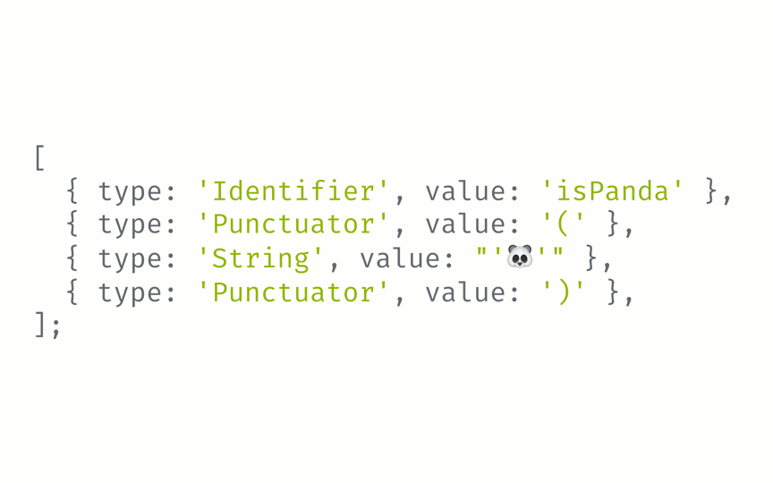

# Abstract Syntax Trees
## What is it?

- Acts as the intermediate step between the front end and back end of the compiler.
- It's called an abstract syntax tree because it abstracts away information by storing it in a tree structure.
    - Storing it in a tree structure allows it to abstract away information such as brackets due to it being in a hierarchical structure.
- Below are some basic equations broken into an AST.

## How is Source Code Processed
- Source code goes through lexical analysis which involves the compiler looking through the source code for tokens. 
    - A token can be anything from a literal to function. 
- Once all the tokens have been identified, they are **parsed** in for syntax analysis.
    - This is where the AST is created.
    

---

### Lexical Analysis - Tokenization

---

### Syntax Analysis - Parsing

## Developer Applications of AST

**1. Audits**  
**2. Transforms**  
**3. Linting**

---

### 1.) Code Audits
**A common scenario**:  
Counting how many times a function, variable, component or prop is used in source code.

### 2.) Transforming Code
**A common scenario**:  
Transforming code from one syntax to another.

### 3.) Linting
**A common scenario**:  
Enforcing and applying specific rules for syntax on a code base.

# Have a Play Around with creating and traversing an AST

# References
- [Babel Docs](https://babeljs.io/docs/babel-traverse)
- [Sandpack Docs](https://sandpack.codesandbox.io/docs)
- [Article: What are ASTs](https://www.twilio.com/en-us/blog/abstract-syntax-trees)
- [AST Explorer](https://astexplorer.net/)
