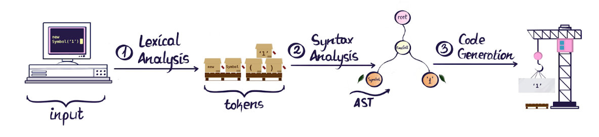
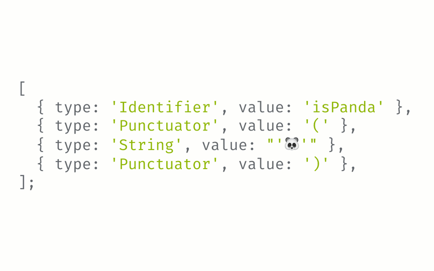

# Abstract Syntax Trees

---

# What is it?
* Acts as the intermediate step between the front end and back end in the compiler.
* It's called an AST because it abstracts away information by storing it in a tree structure.
    * Tree Structure represents a form of hierarchy.

---

## How is Source Code Processed

---

### Lexical Analysis - Tokenization

---

### Syntax Analysis - Parsing

---

# Live Demo with Visualizer

---

#### Why Bother?
#### How Can We Use Them?
#### Are You Wasting My Time?

---

# FEAR NOT
##### my esteemed colleagues

---

## Developer Applications of AST

1. Audits
2. Transforms
3. Linting

---

# 1.) Code Audits
##### A common scenario:
Counting how many times a function, variable, component or prop is used in source code.

---

# 2.) Transforming Code
##### A common scenario:
Transforming code from one syntax to another.

---

# 3.) Linting
##### A common scenario: 
Enforcing and applying specific rules for syntax on a code base.

---
# Thank You For Your Attention

###### منتهي